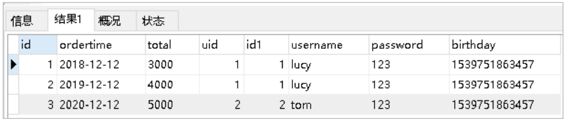

## Mybatis简介

#### 1、原始jdbc操作

* 查询数据


* 插入数据

  

#### 2、原始jdbc操作的分析

原始jdbc开发存在的问题如下： 

① 数据库连接创建、释放频繁造成系统资源浪费从而影响系统性能 

② sql 语句在代码中硬编码，造成代码不易维护，实际应用 sql 变化的可能较大，sql 变动需要改变java代码。 

③ 查询操作时，需要手动将结果集中的数据手动封装到实体中。插入操作时，需要手动将实体的数据设置到sql语句的占位 符位置 

应对上述问题给出的解决方案：

 ① 使用数据库连接池初始化连接资源 

② 将sql语句抽取到xml配置文件中 

③ 使用反射、内省等底层技术，自动将实体与表进行属性与字段的自动映射

#### 3、什么是Mybatis


## Mybatis的快速入门

#### 1、MyBatis开发步骤

MyBatis官网地址：http://www.mybatis.org/mybatis-3/

MyBatis开发步骤： 

① 添加MyBatis的依赖 

② 创建user数据表 

③ 编写User实体类 

④ 编写映射文件UserMapper.xml 

⑤ 编写核心文件SqlMapConfig.xml 

⑥ 编写测试类

#### 2、 环境搭建

1. 导入MyBatis的坐标和其他相关依赖

   ```xml
   <!--mybatis坐标-->
   <dependency>
       <groupId>org.mybatis</groupId>
       <artifactId>mybatis</artifactId>
       <version>3.4.5</version>
   </dependency>
   <!--mysql驱动坐标-->
   <dependency>
       <groupId>mysql</groupId>
       <artifactId>mysql-connector-java</artifactId>
       <version>5.1.6</version>
       <scope>runtime</scope>
   </dependency>
   <!--单元测试坐标-->
   <dependency>
       <groupId>junit</groupId>
       <artifactId>junit</artifactId>
       <version>4.12</version>
       <scope>test</scope>
   </dependency>
   <!--日志坐标-->
   <dependency>
       <groupId>log4j</groupId>
       <artifactId>log4j</artifactId>
       <version>1.2.12</version>
   </dependency>
   ```

2. 创建user数据表

   

3. 编写User实体

   ```java
   public class User {
       private int id;
       private String username;
       private String password;
       //省略get个set方法
   }
   ```

4. 编写UserMapper映射文件

   ```xml-dtd
   <?xml version="1.0" encoding="UTF-8" ?>
   <!DOCTYPE mapper
   PUBLIC "-//mybatis.org//DTD Mapper 3.0//EN"
   "http://mybatis.org/dtd/mybatis-3-mapper.dtd">
   <mapper namespace="userMapper">
       <select id="findAll" resultType="com.itheima.domain.User">
       	select * from User
       </select>
   </mapper>
   ```

5. 编写MyBatis核心文件（SqlMapConfig.xml ）

   ```xml
   <?xml version="1.0" encoding="utf-8"?>
   <!DOCTYPE configuration PUBLIC "-//mybatis.org//DTD Config 3.0//EN"
           "http://mybatis.org/dtd/mybatis-3-config.dtd">
   
   <configuration>
       <!-- 数据源环境 -->
       <environments default="development">
           <environment id="development">
               <transactionManager type="JDBC"></transactionManager>
               <dataSource type="POOLED">
                   <property name="driver" value="com.mysql.jdbc.Driver"/>
                   <property name="url" value="jdbc:mysql://localhost:3306/test"/>
                   <property name="username" value="root"/>
                   <property name="password" value="root"/>
               </dataSource>
           </environment>
       </environments>
   
       <mappers>
           <mapper resource="com/example/mapper/UserMapper.xml"/>
       </mappers>
   </configuration>
   ```

#### 3、编写测试代码

```java
//加载核心配置文件
InputStream resourceAsStream = Resources.getResourceAsStream("SqlMapConfig.xml");
//获得sqlSession工厂对象
SqlSessionFactory sqlSessionFactory = new SqlSessionFactoryBuilder().build(resourceAsStream);
//获得sqlSession对象
SqlSession sqlSession = sqlSessionFactory.openSession();
//执行sql语句
List<User> userList = sqlSession.selectList("userMapper.findAll");
//打印结果
System.out.println(userList);
//释放资源
sqlSession.close();
```

#### 4、知识小结

MyBatis开发步骤： 

① 添加MyBatis的依赖 

② 创建user数据表 

③ 编写User实体类 

④ 编写映射文件UserMapper.xml 

⑤ 编写核心文件SqlMapConfig.xml 

⑥ 编写测试类

##  MyBatis的映射文件概述


## MyBatis的增删改查操作

#### 1、MyBatis的插入数据操作

1. 编写UserMapper映射文件

   ```xml
   <mapper namespace="userMapper">
       <insert id="add" parameterType="com.example.domain.User">
       	insert into user values(#{id},#{username},#{password})
       </insert>
   </mapper>
   ```

2. 编写插入实体User的代码

   ```java
   InputStream resourceAsStream = Resources.getResourceAsStream("SqlMapConfig.xml");
   SqlSessionFactory sqlSessionFactory = new SqlSessionFactoryBuilder().build(resourceAsStream);
   SqlSession sqlSession = sqlSessionFactory.openSession();
   int insert = sqlSession.insert("userMapper.add", user);
   System.out.println(insert);
   //提交事务
   sqlSession.commit();
   sqlSession.close();
   ```

3. 插入操作注意问题

   * 插入语句使用insert标签
   * 在映射文件中使用parameterType属性指定要插入的数据类型
   * Sql语句中使用#{实体属性名}方式引用实体中的属性值
   * 插入操作使用的API是sqlSession.insert(“命名空间.id”,实体对象);
   * 插入操作涉及数据库数据变化，所以要使用sqlSession对象显示的提交事务， 即sqlSession.commit()

#### 2、MyBatis的修改数据操作

1. 编写UserMapper映射文件

   ```xml
   <mapper namespace="userMapper">
       <update id="update" parameterType="com.example.domain.User">
       	update user set username=#{username},password=#{password} where id=#{id}
       </update>
   </mapper>
   ```

   

2. 编写修改实体User的代码

   ```java
   InputStream resourceAsStream = Resources.getResourceAsStream("SqlMapConfig.xml");
   SqlSessionFactory sqlSessionFactory = new SqlSessionFactoryBuilder().build(resourceAsStream);
   SqlSession sqlSession = sqlSessionFactory.openSession();
   int update = sqlSession.update("userMapper.update", user);
   System.out.println(update);
   sqlSession.commit();
   sqlSession.close();
   ```

3. 修改操作注意问题

   * 修改语句使用update标签
   * 修改操作使用的API是sqlSession.update(“命名空间.id”,实体对象);
   * 必须手动提交事务

#### 3、MyBatis的删除数据操作

1. 编写UserMapper映射文件

   ```xml
   <mapper namespace="userMapper">
       <delete id="delete" parameterType="java.lang.Integer">
       	delete from user where id=#{id}
       </delete>
   </mapper>
   ```

2.  编写删除数据的代码

   ```java
   InputStream resourceAsStream = Resources.getResourceAsStream("SqlMapConfig.xml");
   SqlSessionFactory sqlSessionFactory = new SqlSessionFactoryBuilder().build(resourceAsStream);
   SqlSession sqlSession = sqlSessionFactory.openSession();
   int delete = sqlSession.delete("userMapper.delete",3);
   System.out.println(delete);
   sqlSession.commit();
   sqlSession.close();
   ```

3. 删除操作注意问题

   * 删除语句使用delete标签
   * Sql语句中使用#{任意字符串}方式引用传递的单个参数
   * 删除操作使用的API是sqlSession.delete(“命名空间.id”,Object);

#### 4、知识小结

只要涉及到修改表，都要进行事务提交操作。

增删改查映射配置与API：

查询数据：

```java
List userList = sqlSession.selectList("userMapper.findAll");
```

```xml
<select id="findAll" resultType="com.example.domain.User">
	select * from User
</select>
```

添加数据：

```java
sqlSession.insert("userMapper.add", user);
```

```xml
<insert id="add" parameterType="com.itheima.domain.User">
	insert into user values(#{id},#{username},#{password})
</insert>
```

修改数据：

```java
sqlSession.update("userMapper.update", user);
```

```xml
<update id="update" parameterType="com.itheima.domain.User">
	update user set username=#{username},password=#{password} where id=#{id}
</update>
```

删除数据：

```java
sqlSession.delete("userMapper.delete",3);
```

```xml
<delete id="delete" parameterType="java.lang.Integer">
	delete from user where id=#{id}
</delete>
```

## MyBatis核心配置文件概述

#### 1、MyBatis核心配置文件层级关系


#### 2、MyBatis常用配置解析

1. environments标签

   数据库环境的配置，支持多环境配置

   

   其中，事务管理器（transactionManager）类型有两种：

   * JDBC：这个配置就是直接使用了JDBC 的提交和回滚设置，它依赖于从数据源得到的连接来管理事务作用域。
   * MANAGED：这个配置几乎没做什么。它从来不提交或回滚一个连接，而是让容器来管理事务的整个生命周期（比如JEE  应用服务器的上下文）。 默认情况下它会关闭连接，然而一些容器并不希望这样，因此需要将 closeConnection 属性设置 为 false 来阻止它默认的关闭行为。

   其中，数据源（dataSource）类型有三种：

   * UNPOOLED：这个数据源的实现只是每次被请求时打开和关闭连接。
   * POOLED：这种数据源的实现利用“池”的概念将 JDBC 连接对象组织起来。
   * JNDI：这个数据源的实现是为了能在如 EJB 或应用服务器这类容器中使用，容器可以集中或在外部配置数据源，然后放置 一个 JNDI 上下文的引用。

2. mapper标签

   该标签的作用是加载映射的，加载方式有如下几种：

   * 使用相对于类路径的资源引用，例如：

     ```xml
     <mapper resource="org/mybatis/builder/AuthorMapper.xml"/>
     ```

   * 使用完全限定资源定位符（URL），例如：

     ```xml
     <mapper url="file:///var/mappers/AuthorMapper.xml"/>
     ```

   * 使用映射器接口实现类的完全限定类名，例如：

     ```xml
     <mapper class="org.mybatis.builder.AuthorMapper"/>
     ```

   * 将包内的映射器接口实现全部注册为映射器，例如：

     ```xml
     <package name="org.mybatis.builder"/>
     ```

3. Properties标签

   实际开发中，习惯将数据源的配置信息单独抽取成一个properties文件，该标签可以加载额外配置的properties文件

   

4. typeAliases标签

   类型别名是为Java 类型设置一个短的名字。原来的类型名称配置如下

   

   配置typeAliases，为com.itheima.domain.User定义别名为user

    

   上面我们是自定义的别名，mybatis框架已经为我们设置好的一些常用的类型的别名

   

5.  知识小结

   核心配置文件常用配置：

   1、properties标签：该标签可以加载外部的properties文件

   

   2、typeAliases标签：设置类型别名

   

   3、mappers标签：加载映射配置

   

   4、environments标签：数据源环境配置标签

   

## MyBatis相应API

#### 1、SqlSession工厂构建器SqlSessionFactoryBuilder

常用API：SqlSessionFactory build(InputStream inputStream) 

通过加载mybatis的核心文件的输入流的形式构建一个SqlSessionFactory对象

```java
String resource = "org/mybatis/builder/mybatis-config.xml";
InputStream inputStream = Resources.getResourceAsStream(resource);
SqlSessionFactoryBuilder builder = new SqlSessionFactoryBuilder();
SqlSessionFactory factory = builder.build(inputStream);
```

其中， Resources 工具类，这个类在 org.apache.ibatis.io 包中。Resources 类帮助你从类路径下、文件系统或 一个 web URL 中加载资源文件。

#### 2、SqlSession工厂对象SqlSessionFactory

SqlSessionFactory 有多个个方法创建 SqlSession 实例。常用的有如下两个：


#### 3、SqlSession会话对象

SqlSession 实例在 MyBatis 中是非常强大的一个类。在这里你会看到所有执行语句、提交或回滚事务和获取映射器实例的方法。 执行语句的方法主要有：

```java
<T> T selectOne(String statement, Object parameter) 
<E> List<E> selectList(String statement, Object parameter) 
int insert(String statement, Object parameter) 
int update(String statement, Object parameter) 
int delete(String statement, Object parameter)
```

操作事务的方法主要有：

```java
void commit()
void rollback()
```

## Mybatis的Dao层实现

#### 1、传统开发方式

1. 编写UserMapper接口

   ```java
   public interface UserMapper {
   	List<User> findAll() throws IOException;
   }
   ```

2. 编写UserDaoImpl实现

   ```java
   public class UserMapperImpl implements UserMapper {
       public List<User> findAll() throws IOException {
           InputStream resourceAsStream = Resources.getResourceAsStream("SqlMapConfig.xml");
           
           SqlSessionFactory sqlSessionFactory = new SqlSessionFactoryBuilder().build(resourceAsStream);
           
           SqlSession sqlSession = sqlSessionFactory.openSession();
           
           List<User> userList = sqlSession.selectList("userMapper.findAll");
           sqlSession.close();
           
           return userList;
       }
   }
   ```

3. 测试传统方式

   ```java
   @Test
   public void testTraditionDao() throws IOException {
       UserMapper userMapper = (UserMapper) new UserMapperImpl();
       List<User> all = userMapper.findAll();
       System.out.println(all);
   }
   ```

#### 2、代理开发方式

1. **代理开发方式介绍**

   采用 Mybatis 的代理开发方式实现 DAO 层的开发，这种方式是我们后面进入企业的主流。 Mapper 接口开发方法只需要程序员编写Mapper 接口（相当于Dao 接口），由Mybatis 框架根据接口定义创建接 口的动态代理对象，代理对象的方法体同上边Dao接口实现类方法。 Mapper 接口开发需要遵循以下规范： 

   1、 Mapper.xml文件中的namespace与mapper接口的全限定名相同 

   2、 Mapper接口方法名和Mapper.xml中定义的每个statement的id相同 

   3、 Mapper接口方法的输入参数类型和mapper.xml中定义的每个sql的parameterType的类型相同 

   4、 Mapper接口方法的输出参数类型和mapper.xml中定义的每个sql的resultType的类型相同

2. **编写UserMapper接口**

   

3. **测试代理方式**

   ```java
   @Test
   public void testProxyDao() throws IOException {
       InputStream resourceAsStream = Resources.getResourceAsStream("SqlMapConfig.xml");
       
       SqlSessionFactory sqlSessionFactory = new SqlSessionFactoryBuilder().build(resourceAsStream);
       
       SqlSession sqlSession = sqlSessionFactory.openSession();
       
       //获得MyBatis框架生成的UserMapper接口的实现类
       UserMapper userMapper = sqlSession.getMapper(UserMapper.class);
       User user = userMapper.findById(1);
       
       System.out.println(user);
       sqlSession.close();
   }
   ```

#### 3、 知识小结

MyBatis的Dao层实现的两种方式：

* 手动对Dao进行实现：传统开发方式

* 代理方式对Dao进行实现：

  UserMapper userMapper = sqlSession.getMapper(UserMapper.class);

  

## MyBatis映射文件深入

#### 1、动态sql语句

1. 动态sql语句概述

   Mybatis 的映射文件中，前面我们的 SQL 都是比较简单的，有些时候业务逻辑复杂时，我们的 SQL是动态变化的， 此时在前面的学习中我们的 SQL 就不能满足要求了。 参考的官方文档，描述如下：

   

2. 动态 SQL 之 `<if>`

   我们根据实体类的不同取值，使用不同的 SQL语句来进行查询。比如在 id如果不为空时可以根据id查询，如果 username 不同空时还要加入用户名作为条件。这种情况在我们的多条件组合查询中经常会碰到。

   ```xml
   <select id="findByCondition" parameterType="user" resultType="user">
       select * from User
       <where>
           <if test="id!=0">
           and id=#{id}
           </if>
           <if test="username!=null">
           and username=#{username}
           </if>
       </where>
   </select>
   ```

   当查询条件id和username都存在时，控制台打印的sql语句如下：

   ```java
   … … …
   //获得MyBatis框架生成的UserMapper接口的实现类
   UserMapper userMapper = sqlSession.getMapper(UserMapper.class);
   User condition = new User();
   condition.setId(1);
   condition.setUsername("lucy");
   User user = userMapper.findByCondition(condition);
   … … …
   ```

   

   当查询条件只有id存在时，控制台打印的sql语句如下：

   ```java
   … … …
   //获得MyBatis框架生成的UserMapper接口的实现类
   UserMapper userMapper = sqlSession.getMapper(UserMapper.class);
   User condition = new User();
   condition.setId(1);
   User user = userMapper.findByCondition(condition);
   … … …
   ```

   

3. 动态 SQL 之 ` <foreach>`

   循环执行sql的拼接操作，例如：SELECT * FROM USER WHERE id IN (1,2,5)。

   ```xml
   <select id="findByIds" parameterType="list" resultType="user">
       select * from User
       <where>
           <foreach collection="array" open="id in(" close=")" item="id" separator=",">
               #{id}
           </foreach>
       </where>
   </select>
   ```

   测试代码片段如下：

   ```java
   … … …
   //获得MyBatis框架生成的UserMapper接口的实现类
   UserMapper userMapper = sqlSession.getMapper(UserMapper.class);
   int[] ids = new int[]{2,5};
   List<User> userList = userMapper.findByIds(ids);
   System.out.println(userList);
   … … …
   ```

   

   foreach标签的属性含义如下： 

   标签用于遍历集合，它的属性：

   * collection：代表要遍历的集合元素，注意编写时不要写#{}
   * open：代表语句的开始部分
   * close：代表结束部分
   * item：代表遍历集合的每个元素，生成的变量名
   * sperator：代表分隔符

#### 2、SQL片段抽取

Sql 中可将重复的 sql 提取出来，使用时用 include 引用即可，最终达到 sql 重用的目的

```xml
<!--抽取sql片段简化编写-->
<sql id="selectUser" select * from User</sql>
<select id="findById" parameterType="int" resultType="user">
    <include refid="selectUser"></include> 
    where id=#{id}
</select>
<select id="findByIds" parameterType="list" resultType="user">
    <include refid="selectUser"></include>
    <where>
        <foreach collection="array" open="id in(" close=")" item="id" separator=",">
        #{id}
        </foreach>
    </where>
</select>
```

#### 3、知识小结

MyBatis映射文件配置： 

`<select>`：查询 

`<insert>`：插入 

`<update>`：修改 

`<delete>`：删除 

`<where>`：where条件 

`<if>`：if判断 

`<foreach>`：循环 

`<sql>`：sql片段抽取

## MyBatis核心配置文件深入

#### 1、typeHandlers标签

无论是 MyBatis 在预处理语句（PreparedStatement）中设置一个参数时，还是从结果集中取出一个值时， 都会用 类型处理器将获取的值以合适的方式转换成 Java 类型。下表描述了一些默认的类型处理器（截取部分）。


你可以重写类型处理器或创建你自己的类型处理器来处理不支持的或非标准的类型。具体做法为：实现 `org.apache.ibatis.type.TypeHandler` 接口， 或继承一个很便利的类 `org.apache.ibatis.type.BaseTypeHandler`， 然 后可以选择性地将它映射到一个JDBC类型。例如需求：一个Java中的Date数据类型，我想将之存到数据库的时候存成一 个1970年至今的毫秒数，取出来时转换成java的Date，即java的Date与数据库的varchar毫秒值之间转换。

开发步骤：

① 定义转换类继承类`BaseTypeHandler `

② 覆盖4个未实现的方法，其中`setNonNullParameter`为java程序设置数据到数据库的回调方法，`getNullableResult `为查询时 mysql的字符串类型转换成 java的Type类型的方法 

③ 在MyBatis核心配置文件中进行注册 

④ 测试转换是否正确

```java
public class MyDateTypeHandler extends BaseTypeHandler<Date> {
    public void setNonNullParameter(PreparedStatement preparedStatement, int i, Date date, JdbcType type) 
    {
    	preparedStatement.setString(i,date.getTime()+"");
    }
    public Date getNullableResult(ResultSet resultSet, String s) throws SQLException {
    	return new Date(resultSet.getLong(s));
    }
    public Date getNullableResult(ResultSet resultSet, int i) throws SQLException {
    	return new Date(resultSet.getLong(i));
    }
    public Date getNullableResult(CallableStatement callableStatement, int i) throws SQLException {
    	return callableStatement.getDate(i);
    }
}
```

```xml
<!--注册类型自定义转换器-->
<typeHandlers>
	<typeHandler handler="com.example.typeHandlers.MyDateTypeHandler"></typeHandler>
</typeHandlers>
```

测试添加操作：

```java
user.setBirthday(new Date());
userMapper.add2(user);
```

数据库数据：


测试查询操作：


#### 2、plugins标签

MyBatis可以使用第三方的插件来对功能进行扩展，分页助手PageHelper是将分页的复杂操作进行封装，使用简单的方式即 可获得分页的相关数据 

开发步骤：

① 导入通用PageHelper的依赖

```xml
<!-- 分页助手 -->
<dependency>
    <groupId>com.github.pagehelper</groupId>
    <artifactId>pagehelper</artifactId>
    <version>3.7.5</version>
</dependency>
<dependency>
    <groupId>com.github.jsqlparser</groupId>
    <artifactId>jsqlparser</artifactId>
    <version>0.9.1</version>
</dependency>
```

② 在mybatis核心配置文件中配置PageHelper插件 

```xml
<!-- 注意：分页助手的插件 配置在通用馆mapper之前 -->
<plugins>
    <plugin interceptor="com.github.pagehelper.PageHelper">
        <!-- 指定方言 -->
        <property name="dialect" value="mysql"/>
    </plugin>
</plugins>
```


③ 测试分页数据获取

```java
@Test
public void testPageHelper(){
    //设置分页参数 当前页+每页显示的条数
    PageHelper.startPage(1, 2);
    List<User> userList = userMapper.findAll();
    
    for(User user : userList){
    	System.out.println(user);
    }
}
```

获得分页相关的其他参数

```java
//其他分页的数据
PageInfo<User> pageInfo = new PageInfo<User>(userList);
System.out.println("总条数："+pageInfo.getTotal());
System.out.println("总页数："+pageInfo.getPages());
System.out.println("当前页："+pageInfo.getPageNum());
System.out.println("上一页："+pageInfo.getPrePage());
System.out.println("下一页："+pageInfo.getNextPage());
System.out.println("每页显示的总条数："+pageInfo.getPageSize());
System.out.println("是否第一页："+pageInfo.isIsFirstPage());
System.out.println("是否最后一页："+pageInfo.isIsLastPage());
```

### 3、知识小结

MyBatis核心配置文件常用标签： 

1、properties标签：该标签可以加载外部的properties文件 

2、typeAliases标签：设置类型别名 

3、environments标签：数据源环境配置标签 

4、typeHandlers标签：配置自定义类型处理器 

5、plugins标签：配置MyBatis的插件

## Mybatis多表查询

#### 1、一对一查询

1. 一对一查询的模型

   用户表和订单表的关系为，一个用户有多个订单，一个订单只从属于一个用户 一对一查询的需求：查询一个订单，与此同时查询出该订单所属的用户

   

2. 一对一查询的语句

   对应的sql语句：select * from orders o,user u where o.uid=u.id; 

   查询的结果如下：

   

3. 创建Order和User实体

   ```java
   public class Order {
       private int id;
       private Date ordertime;
       private double total;
       
       //代表当前订单从属于哪一个客户
       private User user;
   }
   ```

   ```java
   public class User {
       private int id;
       private String username;
       private String password;
       private Date birthday;
   }
   ```

   

4. 创建OrderMapper接口

   ```java
   public interface OrderMapper {
   	List<Order> findAll();
   }
   ```

5. 配置OrderMapper.xml

   ```xml
   <mapper namespace="com.example.mapper.OrderMapper">
       <resultMap id="orderMap" type="com.example.domain.Order">
           <result column="uid" property="user.id"></result>
           <result column="username" property="user.username"></result>
           <result column="password" property="user.password"></result>
           <result column="birthday" property="user.birthday"></result>
       </resultMap>
       <select id="findAll" resultMap="orderMap">
       	select * from orders o,user u where o.uid=u.id
       </select>
   </mapper>
   ```

   其中`<resultMap>`还可以配置如下:

   ```xml
   <resultMap id="orderMap" type="com.example.domain.Order">
       <result property="id" column="id"></result>
       <result property="ordertime" column="ordertime"></result>
       <result property="total" column="total"></result>
       
       <association property="user" javaType="com.example.domain.User">
           <result column="uid" property="id"></result>
           <result column="username" property="username"></result>
           <result column="password" property="password"></result>
           <result column="birthday" property="birthday"></result>
       </association>
   </resultMap>
   ```

6. 测试结果

   ```java
   OrderMapper mapper = sqlSession.getMapper(OrderMapper.class);
   List<Order> all = mapper.findAll();
   
   for(Order order : all){
   	System.out.println(order);
   }
   ```

   

#### 2、一对多查询

1. 一对多查询的模型

   用户表和订单表的关系为，一个用户有多个订单，一个订单只从属于一个用户 一对多查询的需求：查询一个用户，与此同时查询出该用户具有的订单

   

2. 一对多查询的语句

   对应的sql语句：select *,o.id oid from user u left join orders o on u.id=o.uid; 

   查询的结果如下：

   

3. 修改User实体

   ```java
   public class Order {
       private int id;
       private Date ordertime;
       private double total;
       
       //代表当前订单从属于哪一个客户
       private User user;
   }
   ```

   ```java
   public class User {
       private int id;
       private String username;
       private String password;
       private Date birthday;
       
       //代表当前用户具备哪些订单
       private List<Order> orderList;
   }
   ```

4. 创建UserMapper接口

   ```java
   public interface UserMapper {
   	List<User> findAll();
   }
   ```

5. 配置UserMapper.xml

   ```xml
   <mapper namespace="com.example.mapper.UserMapper">
       <resultMap id="userMap" type="com.example.domain.User">
           <result column="id" property="id"></result>
           <result column="username" property="username"></result>
           <result column="password" property="password"></result>
           <result column="birthday" property="birthday"></result>
           
           <collection property="orderList" ofType="com.example.domain.Order">
               <result column="oid" property="id"></result>
               <result column="ordertime" property="ordertime"></result>
               <result column="total" property="total"></result>
           </collection>
       </resultMap>
       
       <select id="findAll" resultMap="userMap">
       select *,o.id oid from user u left join orders o on u.id=o.uid
       </select>
   </mapper>
   ```

6. 测试结果

   ```java
   UserMapper mapper = sqlSession.getMapper(UserMapper.class);
   List<User> all = mapper.findAll();
   for(User user : all){
       System.out.println(user.getUsername());
       List<Order> orderList = user.getOrderList();
       
       for(Order order : orderList){
       	System.out.println(order);
       }
   	System.out.println("----------------------------------");
   }
   ```

   

#### 3、多对多查询

1. 多对多查询的模型

   用户表和角色表的关系为，一个用户有多个角色，一个角色被多个用户使用 多对多查询的需求：查询用户同时查询出该用户的所有角色

   

2.  多对多查询的语句

   对应的sql语句：select u.*,r.*,r.id rid from user u left join user_role ur on u.id=ur.user_id inner join role r on ur.role_id=r.id;

   查询的结果如下：

   

3. 创建Role实体，修改User实体

   ```java
   public class User {
       private int id;
       private String username;
       private String password;
       private Date birthday;
       
       //代表当前用户具备哪些订单
       private List<Order> orderList;
       //代表当前用户具备哪些角色
       private List<Role> roleList;
   }
   ```

   ```java
   public class Role {
       private int id;
       private String rolename;
   }
   ```

4.  添加UserMapper接口方法

   ```java
   List findAllUserAndRole();
   ```

5. 配置UserMapper.xml

   ```xml
   <resultMap id="userRoleMap" type="com.example.domain.User">
       <result column="id" property="id"></result>
       <result column="username" property="username"></result>
       <result column="password" property="password"></result>
       <result column="birthday" property="birthday"></result>
       <collection property="roleList" ofType="com.example.domain.Role">
           <result column="rid" property="id"></result>
           <result column="rolename" property="rolename"></result>
   	</collection>
   </resultMap>
   
   <select id="findAllUserAndRole" resultMap="userRoleMap">
   select u.*,r.*,r.id rid from user u left join user_role ur on 
   u.id=ur.user_id
   inner join role r on ur.role_id=r.id
   </select>
   ```

6. 测试结果

   ```java
   UserMapper mapper = sqlSession.getMapper(UserMapper.class);
   List<User> all = mapper.findAllUserAndRole();
   
   for(User user : all){
       System.out.println(user.getUsername());
       List<Role> roleList = user.getRoleList();
       
       for(Role role : roleList){
       	System.out.println(role);
       }
       System.out.println("----------------------------------");
   }
   ```

   

#### 4、知识小结

MyBatis多表配置方式： 

一对一配置：使用做配置 

一对多配置：使用+做配置 多对多配置：使用+做配置

## Mybatis的注解开发

#### 1、MyBatis的常用注解

这几年来注解开发越来越流行，Mybatis也可以使用注解开发方式，这样我们就可以减少编写Mapper 映射文件了。我们先围绕一些基本的CRUD来学习，再学习复杂映射多表操作。

@Insert：实现新增 

@Update：实现更新 

@Delete：实现删除 

@Select：实现查询 

@Result：实现结果集封装 

@Results：可以与@Result 一起使用，封装多个结果集 

@One：实现一对一结果集封装 

@Many：实现一对多结果集封装

#### 2、MyBatis的增删改查

我们完成简单的user表的增删改查的操作

```java
public class AnnoMapperTest {

    private UserMapper userMapper;

    @Before
    public void before() throws IOException {
        InputStream resourceAsStream = Resources.getResourceAsStream("SqlMapConfig.xml");
        SqlSessionFactory sqlSessionFactory = new
                SqlSessionFactoryBuilder().build(resourceAsStream);
        SqlSession sqlSession = sqlSessionFactory.openSession(true);

        userMapper = sqlSession.getMapper(UserMapper.class);
    }

    @Test
    public void testAdd() {
        User user = new User();
        user.setUsername("测试数据");
        user.setPassword("123");
        user.setBirthday(new Date());
        userMapper.save(user);
    }

    @Test
    public void testUpdate() throws IOException {
        User user = new User();
        user.setId(7);
        user.setUsername("测试数据修改");
        user.setPassword("abc");
        user.setBirthday(new Date());
        userMapper.update(user);
    }

    @Test
    public void testDelete() throws IOException {
        userMapper.delete(5);
    }

    @Test
    public void testFindById() throws IOException {
        User user = userMapper.findById(3);
        System.out.println(user);
    }

    @Test
    public void testFindAll() throws IOException {
        List<User> all = userMapper.findAll();
        for(User user : all){
            System.out.println(user);
        }
    }
}
```

修改MyBatis的核心配置文件，我们使用了注解替代的映射文件，所以我们只需要加载使用了注解的Mapper接口即可

```xml
<mappers>
    <!--扫描使用注解的类-->
    <mapper class="com.example.annoMapper.UserMapper"></mapper>
</mappers>
```

或者指定扫描包含映射关系的接口所在的包也可以

```xml
<mappers>
    <!--扫描使用注解的类所在的包-->
    <package name="com.example.annoMapper"></package>
</mappers>
```

#### 3、 MyBatis的注解实现复杂映射开发

实现复杂关系映射之前我们可以在映射文件中通过配置来实现，使用注解开发后，我们可以使用`@Results`注解 ，`@Result`注解，`@One`注解，`@Many`注解组合完成复杂关系的配置


#### 4、一对一查询

1. 一对一查询的模型

   用户表和订单表的关系为，一个用户有多个订单，一个订单只从属于一个用户 一对一查询的需求：查询一个订单，与此同时查询出该订单所属的用户

   

2. 一对一查询的语句

   对应的sql语句： select * from orders; select * from user where id=查询出订单的uid;

   查询的结果如下：

   

3. 创建Order和User实体

   ```java
   public class Order {
       private int id;
       private Date ordertime;
       private double total;
       
       //代表当前订单从属于哪一个客户
       private User user;
   }
   ```

   ```java
   public class User {
       private int id;
       private String username;
       private String password;
       private Date birthday;
   }
   ```

4. 创建OrderMapper接口

   ```java
   public interface OrderMapper {
   	List<Order> findAll();
   }
   ```

5. 使用注解配置Mapper

   

   ```java
   public interface OrderMapper {
       @Select("select * from orders")
       @Results({
           @Result(id=true,property = "id",column = "id"),
           @Result(property = "ordertime",column = "ordertime"),
           @Result(property = "total",column = "total"),
           @Result(property = "user",column = "uid",
           javaType = User.class,
           one = @One(select = "com.example.mapper.UserMapper.findById"))
       })
       
       List<Order> findAll();
   }
   ```

   ```java
   public interface UserMapper {
       @Select("select * from user where id=#{id}")
       User findById(int id);
   }
   ```

6. 测试结果

   ```java
   @Test
   public void testSelectOrderAndUser() {
       List<Order> all = orderMapper.findAll();
       
       for(Order order : all){
       	System.out.println(order);
       }
   }
   ```

   

#### 5、一对多查询

1. 一对多查询的模型

   用户表和订单表的关系为，一个用户有多个订单，一个订单只从属于一个用户 一对多查询的需求：查询一个用户，与此同时查询出该用户具有的订单

   

2. 一对多查询的语句

   对应的sql语句： `select * from user; select * from orders where uid=查询出用户的id;`

   查询的结果如下：

   

3. 修改User实体

   ```java
   public class Order {
       private int id;
       private Date ordertime;
       private double total;
       
       //代表当前订单从属于哪一个客户
       private User user;
   }
   ```

   ```java
   public class User {
       private int id;
       private String username;
       private String password;
       private Date birthday;
       
       //代表当前用户具备哪些订单
       private List<Order> orderList;
   }
   ```

4. 创建UserMapper接口

   ```java
   List<User> findAllUserAndOrder();
   ```

5.  使用注解配置Mapper

   

   ```java
   public interface UserMapper {
       @Select("select * from user")
       @Results({
           @Result(id = true,property = "id",column = "id"),
           @Result(property = "username",column = "username"),
           @Result(property = "password",column = "password"),
           @Result(property = "birthday",column = "birthday"),
           @Result(property = "orderList",column = "id",
           javaType = List.class,
           many = @Many(select = "com.example.annoMapper.OrderMapper.findByUid"))
       })
       List<User> findAllUserAndOrder();
   }
   ```

   ```java
   public interface OrderMapper {
       @Select("select * from orders where uid=#{uid}")
       List<Order> findByUid(int uid);
   }
   ```

   

6.  测试结果

   ```java
   List<User> all = userMapper.findAllUserAndOrder();
   
   for(User user : all){
       System.out.println(user.getUsername());
       List<Order> orderList = user.getOrderList();
       for(Order order : orderList){
       	System.out.println(order);
       }
       System.out.println("-----------------------------");
   }
   ```

   

#### 6、多对多查询

1. 多对多查询的模型

   用户表和角色表的关系为，一个用户有多个角色，一个角色被多个用户使用 多对多查询的需求：查询用户同时查询出该用户的所有角色

   

2. 多对多查询的语句

   对应的sql语句：

   ```sql
   select * from user; 
   select * from role r,user_role ur where r.id=ur.role_id and ur.user_id=用户的id
   ```

   查询的结果如下：

   

3. 创建Role实体，修改User实体

   ```java
   public class User {
       private int id;
       private String username;
       private String password;
       private Date birthday;
       //代表当前用户具备哪些订单
       private List<Order> orderList;
       //代表当前用户具备哪些角色
       private List<Role> roleList;
   }
   ```

   ```java
   public class Role {
       private int id;
       private String rolename;
   }
   ```

4. 添加UserMapper接口方法

   ```java
   List<User> findAllUserAndRole();
   ```

5. 使用注解配置Mapper

   

   ```java
   public interface UserMapper {
       @Select("select * from user")
       @Results({
           @Result(id = true,property = "id",column = "id"),
           @Result(property = "username",column = "username"),
           @Result(property = "password",column = "password"),
           @Result(property = "birthday",column = "birthday"),
           @Result(property = "roleList",column = "id",
           javaType = List.class,
           many = @Many(select = "com.example.annoMapper.RoleMapper.findByUid"))
       })
       List<User> findAllUserAndRole();
   }
   ```

   ```java
   public interface RoleMapper {
       @Select("select * from role r,user_role ur where r.id=ur.role_id and ur.user_id=#{uid}")
       List<Role> findByUid(int uid);
   }
   ```

6. 测试结果

   ```java
   UserMapper mapper = sqlSession.getMapper(UserMapper.class);
   List<User> all = mapper.findAllUserAndRole();
   
   for(User user : all){
       System.out.println(user.getUsername());
       List<Role> roleList = user.getRoleList();
       
       for(Role role : roleList){
       	System.out.println(role);
       }
       System.out.println("----------------------------------");
   }
   ```

   